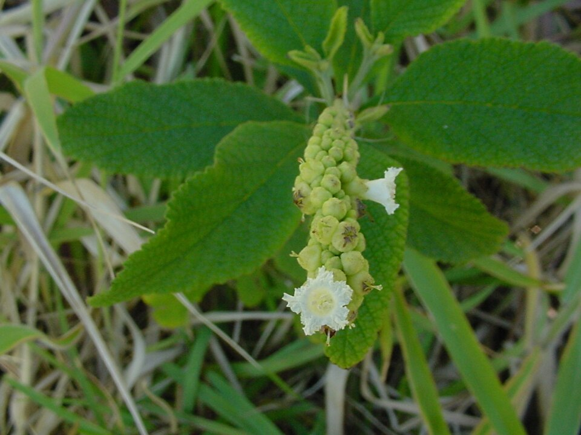

# Repo-IndexerGet-Cordia_Verbenacea-TT39-85RR2.h

- Connector Switch into GitHub-Repository-ENUM Circuit, using like a LIB.verb, the Vegetal Herb {Baloeiro, Cordia Verbenacea, Varronia Curassavica} Entity Line. 

#IMAGE

  
